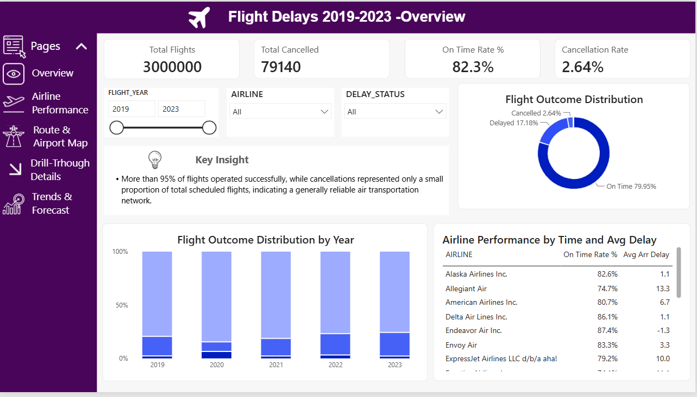
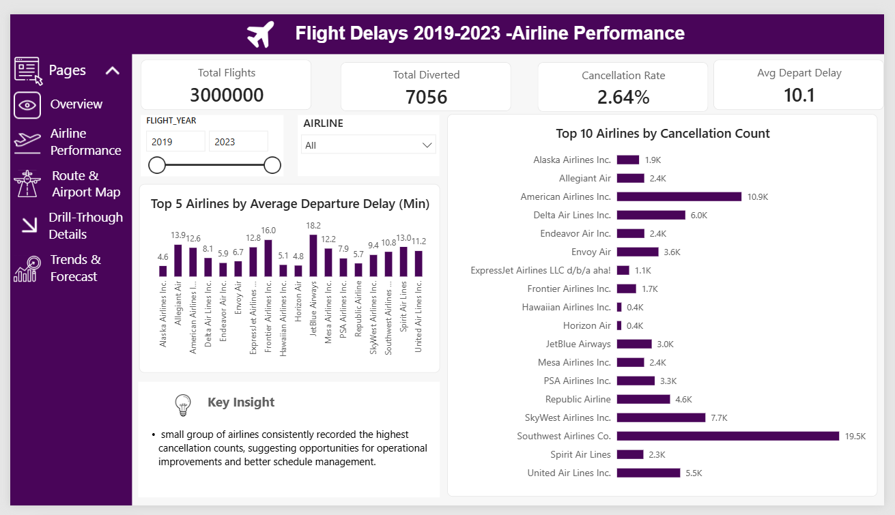
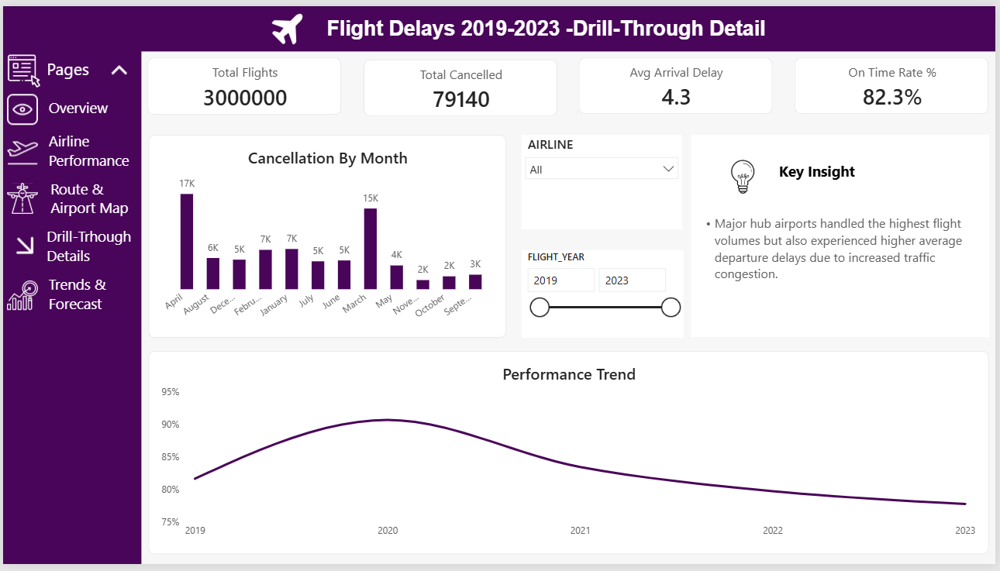
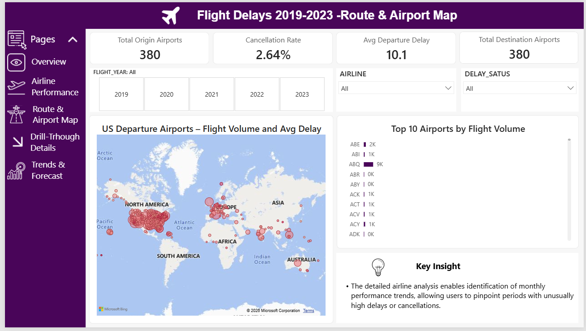
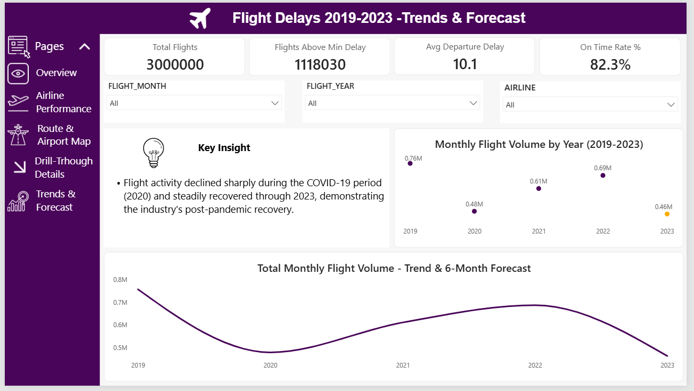
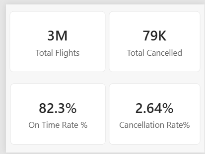

# ✈️ Flight Delay & Cancellation Analysis Dashboard (Power BI)

> A comprehensive **Power BI Business Intelligence Dashboard** built using **3 Million US Flight Records (2019–2023)** to analyze airline performance, delays, cancellations, airport operations, and flight trends.

---

## 📌 Project Overview

This project transforms a large aviation dataset into an interactive Power BI dashboard that helps identify:

- ✈️ Airline Performance
- ⏱ Flight Delay Analysis
- ❌ Cancellation Trends
- 🛫 Airport Traffic Analysis
- 📈 Flight Trends & Forecasting
- 📊 KPI Monitoring

The dashboard is designed for aviation analysts, airport authorities, airline management, and business intelligence professionals.

---

# 🖼 Dashboard Preview

## 🏠 1. Overview Dashboard



Provides a high-level summary of flight operations with key KPIs.

### Key Insights
- Over **3 Million** flights were analyzed.
- More than **82%** of flights arrived on time.
- Cancellation rate remained below **3%**.

---

## ✈️ 2. Airline Performance Dashboard



Compares airline performance based on delays and cancellations.

### Key Insights
- Some airlines consistently maintained higher on-time performance.
- A few airlines contributed disproportionately to total cancellations.

---

## 📋 3. Drill-Through Detail Dashboard



Provides detailed analysis for selected airlines and periods.

### Key Insights
- Delay patterns vary across different months.
- Certain periods experienced noticeably higher cancellation counts.

---

## 🗺 4. Route & Airport Map Dashboard



Visualizes airport traffic and operational performance across the United States.

### Key Insights
- Major hub airports handled the highest traffic.
- Busy airports also experienced relatively higher average delays.

---

## 📈 5. Trends & Forecast Dashboard



Analyzes yearly flight volume with forecasting.

### Key Insights
- Flight traffic dropped significantly during 2020.
- Strong recovery trend observed through 2023.
- Forecast indicates continued operational growth.

---

## 📊 6. Executive Summary



Executive snapshot highlighting the overall performance of the aviation network.

### Key Insights
- Reliable air transportation network with low cancellation rates.
- Strong operational recovery after the pandemic period.
- Dashboard enables quick monitoring of airline efficiency.

---

# 📊 Dashboard KPIs

| KPI | Description |
|------|-------------|
| Total Flights | Total number of flights |
| On-Time Rate % | Percentage of on-time arrivals |
| Total Cancelled | Number of cancelled flights |
| Cancellation Rate | Percentage of cancelled flights |
| Average Departure Delay | Average departure delay (minutes) |
| Average Arrival Delay | Average arrival delay (minutes) |
| Total Diverted Flights | Number of diverted flights |
| Origin Airports | Total origin airports |
| Destination Airports | Total destination airports |

---

# 📂 Dataset

**Dataset Name**

```
flights_sample_3m.csv
```

### Dataset Size

- 3,000,000 Flight Records
- Multiple Airlines
- 2019–2023 Flight Data

### Includes

- Airline
- Flight Date
- Origin Airport
- Destination Airport
- Delay Status
- Arrival Delay
- Departure Delay
- Cancellation Status
- Flight Distance
- Flight Year
- Flight Month
- Airport Information

---

# 🛠 Tools Used

- Microsoft Power BI
- Power Query
- DAX
- Data Modeling
- Forecasting
- Interactive Visualizations

---

# 📈 Dashboard Features

- Interactive Filters
- Dynamic KPIs
- Drill Through Pages
- Forecast Analysis
- Map Visualizations
- Trend Analysis
- Airline Comparison
- Airport Performance Analysis
- Responsive Navigation
- Professional Dashboard Design

---

# 📁 Repository Structure

```
Flight-Delay-Dashboard/
│
├── Dashboard/
│   └── Flight_Delay_and_Cancellation_dashboard.pbix
│
├── Dataset/
│   └── flights_sample_3m.csv
│
├── Dashboard PDF/
│   └── Flight_Delay_and_Cancellation_dashboard.pdf
│
├── screenshots/
│   ├── ss_1.png
│   ├── ss_2.png
│   ├── ss_3.png
│   ├── ss_4.png
│   ├── ss_5.png
│   └── ss_6.png
│
└── README.md
```

---

# 🚀 How to Use

1. Download the repository.
2. Open the `.pbix` file in **Microsoft Power BI Desktop**.
3. If required, reconnect the dataset (`flights_sample_3m.csv`).
4. Refresh the data.
5. Explore the interactive dashboard using filters and slicers.

---

# 📌 Skills Demonstrated

- Data Cleaning
- Data Modeling
- DAX Measures
- Time Intelligence
- KPI Design
- Business Intelligence
- Dashboard Storytelling
- Data Visualization
- Forecasting
- Interactive Reporting

---

# 📄 Project Files

✔ Power BI Dashboard (.pbix)

✔ Dataset (CSV)

✔ Dashboard PDF

✔ Dashboard Screenshots

✔ README Documentation

---

# ⭐ If you found this project helpful

Please consider giving the repository a ⭐ on GitHub.

---

## 👨‍💻 Author

**Meet Mehta**

Power BI Developer • Data Analyst • Business Intelligence Enthusiast

Feel free to connect and explore more of my projects!